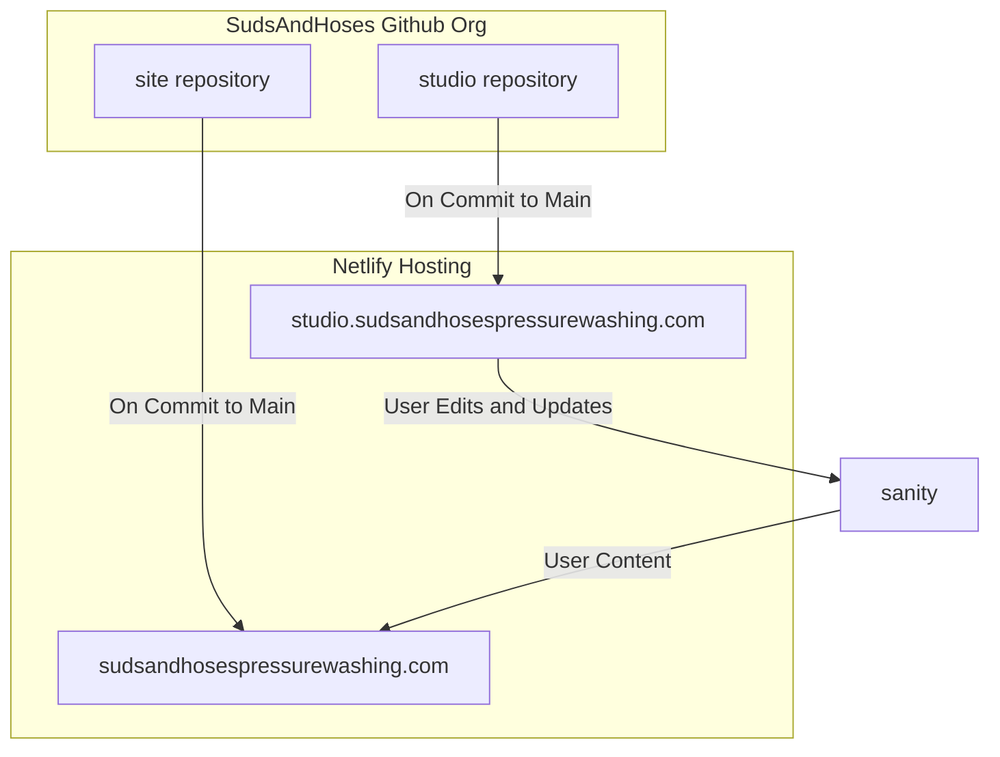

# Suds and Hoses Pressure Washing Website
## Overview
This repo contains the code for the [Suds and Hoses Pressure Washing website](https://sudsandhosespressurewashing.com/website). This site was designed to allow the business owner to edit the content without developer intervention, and to operate at the smallest cost possible. All code and content
## Quick Architecture Overview

### Links
- [Studio](https://studio.sudsandhosespressurewashing.com)
- [Studio Repo](https://github.com/SudsAndHosesPressureWashing/Studio)
- [Sanity](https://www.sanity.io/manage/personal/project/shl5nshb)
- [Site](https://studio.sudsandhosespressurewashing.com)
- [Site Repo](https://github.com/SudsAndHosesPressureWashing/Site)
- [Netlify](https://app.netlify.com/teams/sudsandhoses/overview)

